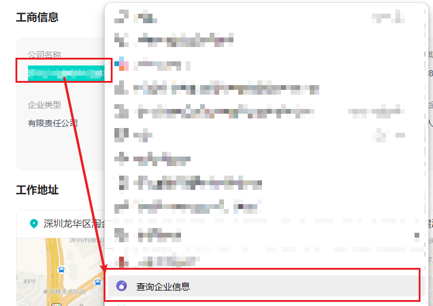

# PinTrustCheck（聘企查）

> - 对于求职者而言，招聘平台上的企业信息繁杂，常需通过公司实缴资本、成立日期、员工人数等数据判断企业可靠性。频繁在招聘平台与企业信息查询平台间切换既繁琐又影响专注力。因此，开发了这个简单的插件PinTrustCheck。
> - 融合“招聘”与“企业查验”，致力于提升查询效率与信息透明度。

## 插件简介
PinTrustCheck（聘企查）是一款开源的浏览器插件，专为BOSS直聘等招聘平台用户设计。选中公司名称后，自动查询企业预警通，显示公司【成立日期】、【实缴资本】、【人员规模】、【参保人数】等关键信息，帮助用户快速甄别企业真实情况。

## 主要功能
- 🖱️ 右键菜单：选中公司名，右键一键查询企业信息
- 🏢 浮窗展示：企业信息以可拖拽浮窗形式展示，支持移动和关闭
- 📋 一键复制公司名
- 🔒 仅在用户授权登录后运行，保障数据安全

## 使用截图

**1. 选中公司名，右键点击菜单项“查询公司信息”**

**2. 查询中，网页右上角会出现浮窗“正在搜索公司信息”**

**3. 查询完成，网页右上角出现查询结果浮窗**

## 安装方法
1. 克隆或下载本项目源码（或release）
2. 打开浏览器扩展管理页面（如 Chrome 地址栏输入 `chrome://extensions/`）
3. 开启“开发者模式”
4. 点击“加载已解压的扩展程序”，选择本项目文件夹

## 使用说明
1. 进入 [BOSS直聘](https://www.zhipin.com/) 页面
2. 用鼠标选中公司名称
3. 右键选择“查询企业信息”
4. 首次使用需登录 [企业预警通](https://www.qyyjt.cn/user/login)
5. 查询结果将以浮窗形式展示在页面右上角，可拖动

## 权限说明
- 仅访问 `zhipin.com` 和 `qyyjt.cn` 域名页面。
- 需要 `contextMenus`、`activeTab`、`storage`、`scripting` 权限，用于右键菜单、内容脚本注入和数据存储。
- 插件不收集、不上传任何用户隐私数据。

## 图标与界面
插件包含多尺寸图标（16/32/48/128px）和 SVG 矢量图，界面简洁美观，支持响应式设计。

## 常见问题
- **信息未显示？** 请确认已登录企业预警通，且网络连接正常。
- **首次使用自动跳转？** 每次重启浏览器后首次使用插件，会自动跳转到企业预警通页面。此时请重新操作一次即可。
- **查询较慢？** 平均查询时间约为 6.92 秒，如超过 10 秒建议重新查询。
- **反馈与建议** 欢迎在 [GitHub Issues](https://github.com/Afterimages/PinTrustCheck/issues) 提交。

## 隐私声明
- 本插件不收集任何用户信息，不存储企业信息，完全免费且开源。
- 用户需使用自己的账号登录企业预警通，插件才能正常工作。
- 请保持企业预警通网页处于打开状态（别关闭），否则每次使用插件时会自动打开企业预警通并跳转至登录页，影响使用体验。

## 开源协议
本项目采用 MIT 许可证，欢迎自由使用、修改和分发。

## 联系方式
- [GitHub Issues](https://github.com/Afterimages/PinTrustCheck/issues)

---

Made with ❤️ by PinTrustCheck Team